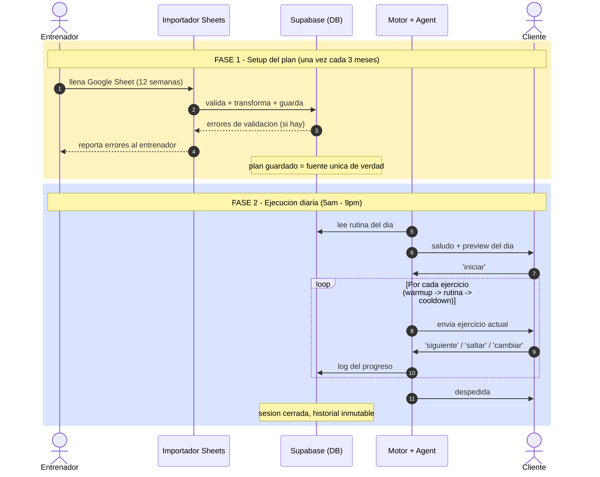

# 01 — Modelo del producto

## Plan de entrenamiento (trimestral mínimo)

- El entrenador diseña un plan de **mínimo 3 meses** (extendible a 4 o 6).
- **Estructura decidida por el entrenador**: carga/descarga, progresivo, días disponibles por semana (3, 4 o 5).
- Cada día se organiza como: `warmup[] + exercises[] + cooldown[]`.
- Cada ejercicio se toma del catálogo o es custom del entrenador.
- El plan es **modificable hacia adelante** en cualquier momento. Lo ya ejecutado queda inmutable como historial.

---

## Flujo diario

### Diagrama de secuencia

Fase 1 ocurre **una vez cada 3 meses**. Fase 2 ocurre **todos los días** durante los 3 meses.

### Narrativa

**Mañana** (hora configurable por cliente, 5am–9pm):
- Saludo motivacional corto.
- Preview: `"Hoy: pierna + core, ~45 min, 6 ejercicios"`.
- No arranca hasta que el cliente diga "iniciar".

**Durante la sesión** (cuando el cliente inicia):
- Arranca con el primer elemento del warmup.
- `"siguiente" / "listo"` → avanza.
- `"saltar ejercicio"` → se marca como no hecho, avanza.
- `"cambiar ejercicio"` → notifica al entrenador (MVP). Post-MVP: alternativas automáticas.
- Flujo: warmup → ejercicios → cooldown.

**Al finalizar:**
- Despedida: `"Bien hecho, nos vemos mañana"`.
- Mensajes posteriores → respuesta mínima automatizada, sin consumir tokens de IA.
- Solo responde a emergencias (ver más abajo).

---

## Comandos del cliente (MVP)

| Intención | Keywords | Acción |
|-----------|----------|--------|
| SIGUIENTE | siguiente, listo, ya, ok, hecho | Avanza al siguiente ejercicio |
| CAMBIAR | cambiar, otro, alternativa | Notifica al entrenador |
| FINALIZAR | terminé, ya, finalizar | Cierra la sesión del día |

**Post-MVP:** migrar a análisis de intención con LLM para lenguaje natural completo.

---

## Gestión de ausencias y casos límite

- **No responde en todo el día** → rutina marcada como "no hecha". Historial. Saludo normal al día siguiente.
- **No responde N días seguidos** (inicial: 3) → notificación al entrenador. El cliente sigue contratado, no se pausa automáticamente.
- **Plan secuencial**: si falla lunes pero entrena martes → hace la rutina del **martes**, NO la del lunes. No se acumulan rutinas.
- **Temas fuera del alcance del agente** (dolor, lesión, dudas técnicas, soporte emocional) → el agente **NO responde**. Notifica al entrenador.
  - Esta línea roja protege al entrenador de parecer reemplazable y a la plataforma de riesgo legal.

---

## Rol del entrenador durante los 3 meses

- Modifica el plan hacia adelante cuando quiera (días o semanas siguientes).
- Recibe notificaciones: cambio de ejercicio solicitado, N días sin responder, reporte de dolor/lesión.
- Ve métricas de progreso de cada cliente.
- Al terminar los 3 meses decide: nuevo plan o extender el actual.
