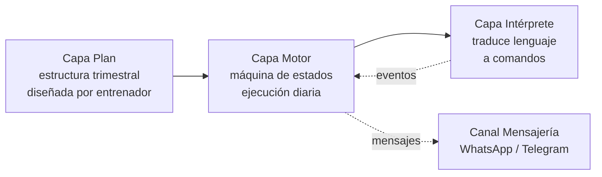
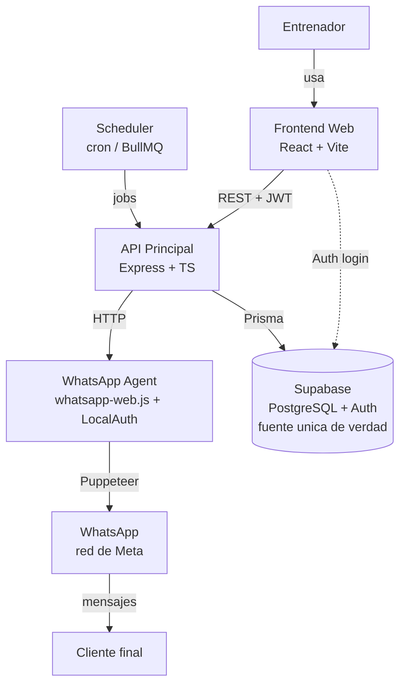

# 02 — Arquitectura v1

## Principio central: tres capas desacopladas



- **Plan** no sabe cómo se ejecuta.
- **Motor** no sabe cómo se interpretan respuestas.
- **Intérprete** no sabe del Plan.

Cambiar cualquiera de las tres no toca las otras dos.

---

## Diagrama de componentes (sistema completo)



---

## Decisiones arquitectónicas confirmadas

- **Multi-tenancy desde el schema**: columna `organization_id` en todas las tablas principales (`trainers`, `clients`, `routines`, `exercise_logs`, …).
  - MVP: cada entrenador independiente = organización de uno.
  - Gimnasio = organización con múltiples entrenadores.
- **Roles `trainer / owner / admin`** listos aunque solo se use `trainer` en MVP.
- **API versionada**: `/api/v1/...` desde el inicio. `/api/v1/organizations/...` cuando entre el gimnasio.
- **Canal de mensajería abstracto** (`libs/messaging/`): interfaz `MessagingChannel` → WhatsApp → Cloud API → Telegram = cambio de implementación, no refactor.
- **Intérprete de intención abstracto** (`libs/nlu/`): `IntentClassifier` como interfaz. V1 keywords, V2 LLM externo.
- **Catálogo de ejercicios** (`libs/exercises/`): módulo independiente. Fuente precargada + ejercicios custom.
- **Timezone por cliente** desde el schema aunque MVP sea todo Popayán. Evita refactor cuando se expanda.

---

## Base de datos (única): Supabase

- **PostgreSQL + Auth en la misma plataforma** (Prisma ORM sobre `public`).
- Schema `auth` gestionado por Supabase Auth (identidades, JWT, recuperación).
- Schema `public` con datos de negocio.
- Tabla `trainers` referencia a `auth.users.id` como FK → *single source of truth*.
- RLS aplicable a nivel DB para aislar por entrenador.
- **Sesión de WhatsApp**: archivos locales en el VPS del Agent vía `LocalAuth` (no DB adicional).

---

## Estructura del monorepo

```
personally/
├── apps/
│   ├── api/          # Express + TS (backend principal)
│   ├── agent/        # Node + whatsapp-web.js
│   ├── scheduler/    # node-cron / BullMQ
│   └── frontend/     # React + Vite
├── libs/
│   ├── core/         # Entidades, reglas de negocio
│   ├── plan/         # Modelo del plan trimestral
│   ├── engine/       # Motor de ejecución (máquina de estados)
│   ├── nlu/          # Intérprete de intención (keywords → LLM)
│   ├── messaging/    # Abstracción de canal (WhatsApp → Telegram)
│   ├── exercises/    # Catálogo + sync con fuentes externas
│   ├── types/        # Compartidos entre front y back
│   └── db/           # Prisma schema
├── .github/workflows/
├── docker/
└── .env, package.json, tsconfig.json
```

---

## Hosting MVP

| Componente | Hosting recomendado |
|------------|---------------------|
| API | Render / Railway |
| WhatsApp Agent | VPS (DigitalOcean / Hetzner) |
| Frontend | Vercel / Netlify |
| PostgreSQL + Auth | Supabase (Free tier) |
| Scheduler | Mismo VPS del Agent o contenedor aparte |
