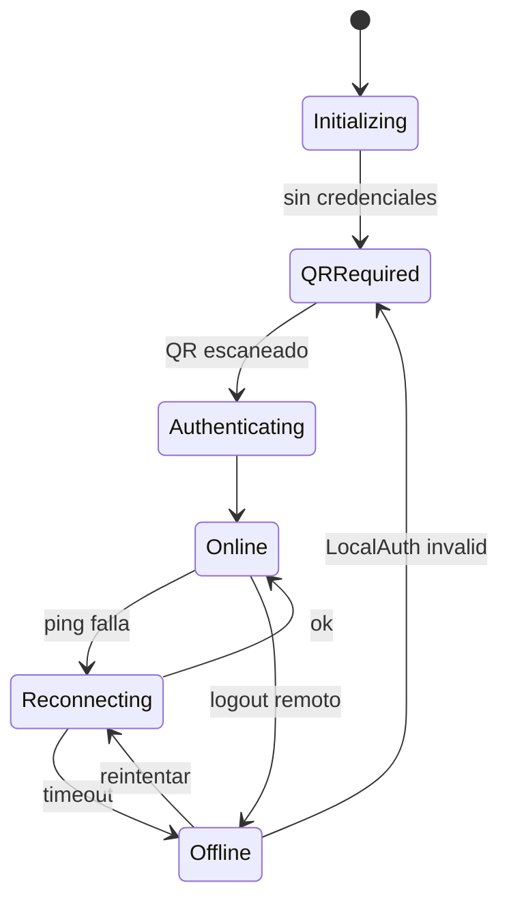
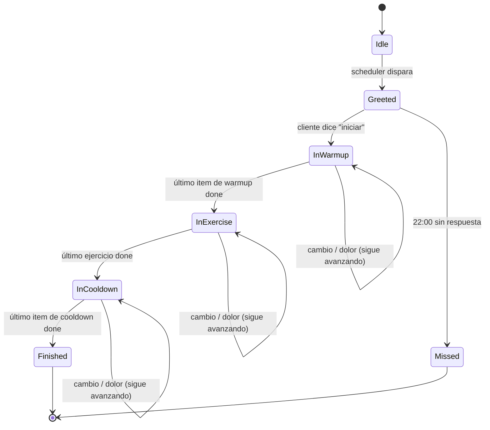

# Bots — Agente WhatsApp

Especificación de `apps/agent`. Node.js + `whatsapp-web.js` con `LocalAuth` (una sesión por entrenador). Implementa la interfaz `MessagingChannel` de `libs/messaging/`.

Referencias:
- [docs/01-producto.md](../../docs/01-producto.md) — flujo diario y comandos
- [docs/05-restricciones-beta.md](../../docs/05-restricciones-beta.md) — mitigación de baneo

---

## 1. Responsabilidad del agente

El agente **NO tiene lógica de negocio**. Es un traductor:

```
WhatsApp (texto libre) ⇄ libs/nlu (intención) ⇄ API (acción) ⇄ plantillas de mensajes
```

Reglas:
- No accede a la DB directamente.
- No decide qué ejercicio sigue (eso lo dice la API cuando recibe `advance`).
- No genera rutinas ni usa LLM para responder (MVP).
- Envía lo que la API le indica.

---

## 2. Ciclo de vida de la sesión WhatsApp

### Estados de sesión (no confundir con sesión de entrenamiento)



### Heartbeat
- Cada **60s** el agente hace `POST /api/v1/internal/agent/heartbeat` con `{ trainerId, state, uptimeSec }`.
- Si la API no recibe heartbeat en **5 min** → dispara `agent-heartbeat-monitor`.

### Alertas proactivas
- Transición a `Reconnecting` repetida ≥3 veces en 10 min → notifica al trainer.
- Transición a `Offline` → notifica al trainer + bandera en frontend.

---

## 3. Máquina de estados de la sesión de entrenamiento

Esta máquina corre **por cliente y por día**. Es la traducción operativa del flujo en [docs/01-producto.md](../../docs/01-producto.md).



> Nota: en el MVP no hay estado `Paused` real. Ni `CHANGE` ni `PAIN` detienen la sesión;
> solo notifican al trainer y la rutina continúa. Ver sección 3.1.

### Transiciones y side-effects

| Estado actual | Intent | Estado siguiente | Acción / side-effect |
|---------------|--------|------------------|----------------------|
| Greeted | START / NEXT | InWarmup | Presenta primer item del bloque |
| InWarmup / InExercise / InCooldown | NEXT | (mismo o avanza bloque) | Marca actual `done`, presenta siguiente |
| InWarmup / InExercise / InCooldown | SKIP | (avanza) | **Difiere** el item 1 slot (max 3). 4ta vez = `skipped` permanente. Ver 3.1 |
| InWarmup / InExercise / InCooldown | CHANGE | (avanza) | Marca actual `changed` + notifica trainer + presenta siguiente |
| InWarmup / InExercise / InCooldown | PAIN | (avanza) | Marca actual `skipped` con nota de dolor + notifica trainer + presenta siguiente. El ejercicio **no reaparece** en esta sesión. Ver 3.1 |
| cualquiera | FINISH | Finished | Cierra sesión, recalcula stats |
| greeted sin ejercicio | PAIN | (igual) | Solo notifica al trainer |

### 3.1 Semántica detallada de SKIP, CHANGE, PAIN

Tres intents "escape" durante la sesión, con comportamientos distintos:

**SKIP — difiere el ejercicio 1 slot hacia adelante**
- Motivación: el cliente no está listo pero puede intentarlo más tarde (ej.: "saltar" el press hasta tener el banco libre).
- Cada SKIP incrementa `deferCount` del log. El orden efectivo pasa a ser `orderInSession + deferCount`.
- Si estás en item 2 y saltás, el orden efectivo de 2 pasa a 3 → se presenta el item 3, luego el 2, luego el 4…
- Al cuarto SKIP del mismo item (`deferCount >= 3`), se marca `skipped` permanente y no reaparece.
- Empates de `effectiveOrder`: los `pending` van antes que los `deferred` (evita que un diferido se muestre justo después de llegar allí).

**CHANGE — cambia por otra alternativa a pedido del trainer**
- Marca el log actual como `changed` y sigue con el siguiente.
- Crea una `notification` de tipo `change_request` para el trainer (con el nombre del ejercicio).
- El trainer decide por fuera qué alternativa proponer. El cliente continúa la rutina mientras tanto.

**PAIN — escalation por dolor o lesión**
- Marca el log actual como `skipped` con `notes: "dolor: <mensaje del cliente, 200 chars>"`.
- El ejercicio **no vuelve a aparecer** en esta sesión (no se difiere — queda terminal).
- Crea una `notification` de tipo `pain_report` para el trainer (con `exerciseLogId` + nombre del ejercicio + mensaje original).
- Presenta el siguiente ejercicio automáticamente. El cliente puede seguir con el resto de la rutina.
- Edge case: si no hay ejercicio presentado (ej.: mensaje durante `greeted`), solo notifica y no intenta avanzar.

### 3.2 Concurrencia / idempotencia

Los mensajes entrantes de un mismo cliente se **serializan** por un mutex in-memory (`withClientLock` en `apps/api/src/modules/internal/routes.ts`). Esto garantiza que si el cliente manda 2 comandos pegados (ej. `"iniciar"` dos veces en <1s), el segundo dispatch espera al primero y ve el estado ya actualizado — no presenta 2 items por race condition.

Si se escala a múltiples instancias del API, habrá que mover el lock a Redis o Postgres advisory lock.

---

## 4. Comandos del cliente (intents MVP)

Implementados en `libs/nlu` con keywords (case-insensitive, sin tildes).

Prioridad: `PAIN` > `FINISH` > `CHANGE` > `SKIP` > `START` > `NEXT`. El primer match gana.

| Intent | Keywords | Notas |
|--------|----------|-------|
| `START` | iniciar, empezar, vamos, arranquemos, comenzar | Solo válido en Greeted |
| `NEXT` | siguiente, listo, next, hecho, termine, ya, ok, dale | Válido en bloques activos |
| `SKIP` | saltar, pasar, skip, no puedo, saltemos, salta | Difiere 1 slot (max 3, luego skipped) |
| `CHANGE` | cambiar, otro, alternativa, reemplazar, no me gusta | Notifica trainer, sigue avanzando |
| `FINISH` | finalizar, fin, termine, acabar, cerrar | Cierra la sesión |
| `PAIN` | dolor, me duele, lesion, lesione, lastimar, lastime, molestia | Notifica trainer, marca skipped con nota, sigue |
| `UNKNOWN` | — | Fallback |

**Fallback `UNKNOWN`:**
- Durante sesión activa: mensaje corto "No entendí. Responde *siguiente*, *saltar* o *cambiar*."
- Fuera de sesión: silencio o "Descansa, mañana seguimos con X".

---

## 5. Plantillas de mensajes

Todas las plantillas viven en `apps/agent/templates/` como funciones `(vars) => string` para permitir variaciones y soportar i18n en el futuro.

### 5.1 Saludo matutino
```
¡Hola {name}! 💪
Hoy toca: {focus}
⏱ ~{duration} min · {exerciseCount} ejercicios

Responde *iniciar* cuando estés listo/a.
```

### 5.2 Inicio de bloque
```
🔥 Arrancamos con el calentamiento ({count} ejercicios).
```
```
🏋️ A la rutina. {count} ejercicios.
```
```
🧘 Cooldown para cerrar.
```

### 5.3 Ejercicio
```
{order}/{total} · {name}
📋 {sets}x{reps} · Descanso: {rest}s
{notes}

[imagen]

Cuando termines, responde *siguiente*.
```

### 5.4 Fin de sesión
```
✅ Bien hecho, {name}.
Mañana seguimos con {nextFocus}.
Descansa. 🙌
```

### 5.5 Respuesta fuera de horario
```
Descansa, mañana seguimos con {nextFocus}.
```
(sin consumir tokens de IA)

### 5.6 Mensaje al trainer (notificación)
El agente **no** escribe al trainer directamente por WhatsApp en MVP. Las notificaciones viven en el frontend (`/notifications`). Post-MVP se evaluará enviar WhatsApp al trainer también.

---

## 6. Mitigación de baneo (reglas operativas)

- **Volumen máximo**: 200 mensajes/día por número en beta.
- **Espaciado aleatorio**: delay aleatorio 500-1500ms entre mensajes consecutivos.
- **Horario activo**: 5:00–21:00 (no envíos fuera).
- **No spam**: cliente solo recibe mensajes si tiene sesión activa o responde explícitamente.
- **Personalización**: nunca plantillas idénticas para >3 clientes el mismo día (variantes en saludo/cierre).
- **Sin envíos masivos simultáneos**: el scheduler reparte a lo largo del día.

---

## 7. Persistencia del agente

- Sesión WhatsApp → `LocalAuth` (filesystem del VPS).
- **No DB propia.** Todo lo que el agente "recuerda" entre reinicios viene de la API.
- Estado en memoria: conexión actual, cola de mensajes pendientes.
- Al reiniciar: reconecta, pregunta a la API por sesiones `in_progress` abiertas.

### Captura de conversación (obligatoria)

Todo mensaje, **inbound y outbound**, se persiste en la tabla `messages` (ver `specs/db/01-rutinas.md §5.3`) vía la API:

- **Inbound**: al recibir, el agente llama `POST /api/v1/internal/clients/:id/incoming-message` **antes** de procesar. Incluye `external_id`, `content_type`, `content_text`, media, `received_at`.
- **Outbound**: al enviar exitosamente, el agente llama `POST /api/v1/internal/clients/:id/outgoing-message` con `external_id`, `template_key`, `is_template_based`, `agent_version`.
- Si el envío falla, se registra igual con `error` poblado.
- Mensajes fuera de sesión (ej. "hola" al mediodía) también se guardan, con `session_id = NULL`.

Esto garantiza que la conversación completa de cualquier sesión sea reconstruible y sirva como dataset de feedback.

---

## 8. Abstracción de canal (`MessagingChannel`)

```ts
interface MessagingChannel {
  send(to: string, message: OutgoingMessage): Promise<void>;
  onIncoming(handler: (msg: IncomingMessage) => void): void;
  getSessionState(): SessionState;
  onSessionStateChange(handler: (state: SessionState) => void): void;
}
```

Implementaciones:
- `WhatsAppWebJsChannel` (MVP).
- `TelegramChannel` (Plan B, scaffold en MVP).
- `WhatsAppCloudApiChannel` (post-beta).

Cambiar canal = cambiar la implementación inyectada. **Lógica de negocio no cambia**.

---

## 9. Pendiente

- [ ] Definir imágenes: ¿mandar una imagen por ejercicio o solo texto en MVP? (sugerido: imagen solo en ejercicios con `image_url` del catálogo).
- [ ] Probar con amigo-piloto si "siguiente después de cada ejercicio" es demasiada fricción o está bien.
- [ ] Definir qué hacer si el cliente manda audio/imagen (MVP: "Por ahora solo puedo leer texto").
- [ ] Umbral exacto de reconexiones fallidas antes de alertar (sugerido: 3 en 10 min).
