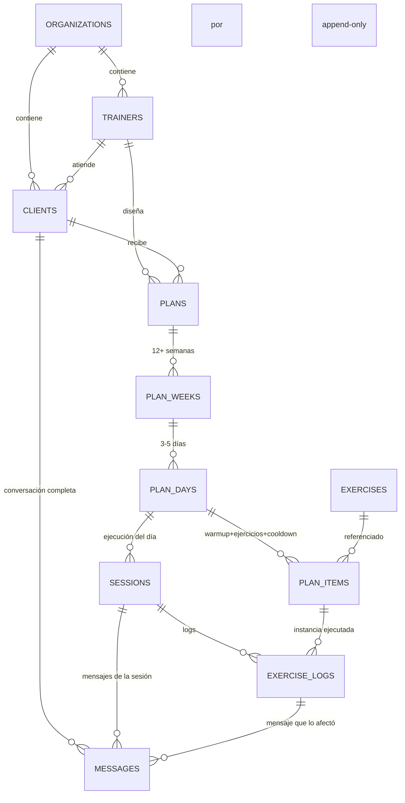

# DB — Modelo de datos de rutinas

Modelo relacional para representar el **plan trimestral** diseñado por el entrenador y su **ejecución diaria** con el cliente.

Referencias: [docs/01-producto.md](../../docs/01-producto.md), [docs/02-arquitectura.md](../../docs/02-arquitectura.md), [aprendizajes/04-db.md](../../aprendizajes/04-db.md).

---

## 1. Principios del modelo

1. **Multi-tenancy desde el schema**: `organization_id` en todas las tablas de negocio.
2. **Plan vs. ejecución desacoplados**: el plan es la partitura (editable hacia adelante); la ejecución es historial (append-only, no se edita).
3. **Jerarquía clara**: `Plan → Week → Day → Item` (warmup / exercise / cooldown).
4. **Catálogo separado**: los ejercicios viven en `exercises` y se **referencian**, nunca se duplican en el plan.
5. **Ciclo de vida explícito**: `presentado ≠ iniciado ≠ completado`. Cada uno con su timestamp.
6. **Sesión como unidad de cumplimiento**: "¿cumplió la rutina de hoy?" es un solo campo, no una agregación sobre 400 filas.
7. **Conversación capturada end-to-end**: **todo** mensaje entrante y saliente se persiste. La conversación completa de una sesión es reconstruible, sirve como insumo para feedback y futuras mejoras de NLU.
8. **Timezone por cliente** desde el inicio.

---

## 2. Mapa de entidades



---

## 3. Tablas — Plan (diseño del entrenador)

### 3.1 `plans` — Plan trimestral por cliente

| Columna | Tipo | Notas |
|---------|------|-------|
| `id` | uuid PK | |
| `organization_id` | uuid FK | multi-tenancy |
| `client_id` | uuid FK → `clients.id` | dueño del plan |
| `trainer_id` | uuid FK → `trainers.id` | autor |
| `name` | text | ej. "Hipertrofia Q2 2026" |
| `goal` | text | objetivo |
| `days_per_week` | int | 3, 4 o 5 |
| `start_date` | date | |
| `end_date` | date | mínimo +90 días |
| `status` | enum | `draft` / `active` / `archived` |
| `created_at`, `updated_at` | timestamptz | |

**Reglas:**
- Un cliente puede tener **1 plan `active`** a la vez.
- `end_date - start_date >= 90 días`.
- Al archivar un plan, su historial (`exercise_logs`) se conserva.

---

### 3.2 `plan_weeks`

| Columna | Tipo | Notas |
|---------|------|-------|
| `id` | uuid PK | |
| `plan_id` | uuid FK | |
| `week_number` | int | 1..N (mínimo 12) |
| `phase` | enum | `load` / `deload` / `test` / `custom` |
| `notes` | text | |

**Unique:** `(plan_id, week_number)`.

---

### 3.3 `plan_days`

| Columna | Tipo | Notas |
|---------|------|-------|
| `id` | uuid PK | |
| `plan_week_id` | uuid FK | |
| `day_of_week` | int | 1=lunes … 7=domingo |
| `focus` | text | "pierna + core", "push" |
| `estimated_duration_min` | int | para preview al cliente |
| `is_rest_day` | bool | default `false` |
| `notes` | text | |

**Unique:** `(plan_week_id, day_of_week)`.

---

### 3.4 `plan_items` — Elementos del día

Un día = lista ordenada de items clasificados por `block`. Incluye soporte de supersets/circuitos.

| Columna | Tipo | Notas |
|---------|------|-------|
| `id` | uuid PK | |
| `plan_day_id` | uuid FK | |
| `block` | enum | `warmup` / `exercise` / `cooldown` |
| `order_index` | int | orden dentro del día |
| `exercise_id` | uuid FK → `exercises.id` | |
| `sets` | int | nullable |
| `reps` | text | "10", "8-12", "AMRAP", "30s" |
| `rest_seconds` | int | nullable |
| `tempo` | text | ej. "3-0-1-0" |
| `load_suggestion` | text | "RPE 7", "70%", "peso cómodo" |
| `rpe_target` | int | 1-10, nullable |
| `cues` | text | indicaciones técnicas del entrenador |
| `notes` | text | notas adicionales del día |
| `group_id` | uuid | **superset/circuito**: items con mismo `group_id` se ejecutan alternados |
| `group_type` | enum | nullable · `superset` / `circuit` / `giant_set` |

**Unique:** `(plan_day_id, block, order_index)`.

**Reglas:**
- Un `plan_day` completo = `warmup[] + exercise[] + cooldown[]` en ese orden.
- Items con mismo `group_id` → el motor los presenta alternados (A1→B1→A2→B2…).
- `rpe_target` y `cues` migran 1:1 desde el schema del demo.

---

## 4. Catálogo

### 4.1 `exercises`

Ya definido en [docs/03-catalogo-ejercicios.md](../../docs/03-catalogo-ejercicios.md).

```sql
exercises (
  id                uuid PK,
  source            enum (free-exercise-db | custom | exercisedb),
  source_ref        text,
  name_es           text,
  name_en           text,
  muscle_primary    text[],
  muscle_secondary  text[],
  equipment         text[],
  instructions      text,
  image_url         text,
  video_url         text,
  created_by        uuid,              -- nullable: trainer que lo creó
  organization_id   uuid               -- nullable: privado a una org
)
```

**Garantía:** `name_es = "Sentadilla"` existe **una sola fila**, referenciada N veces desde `plan_items`. Cambiar `instructions` o `image_url` aquí se refleja en todo el historial y todos los planes.

---

## 5. Ejecución — Historial del cliente

### 5.1 `sessions` — La rutina del día como unidad

| Columna | Tipo | Notas |
|---------|------|-------|
| `id` | uuid PK | |
| `organization_id` | uuid FK | |
| `client_id` | uuid FK | |
| `plan_day_id` | uuid FK | qué día del plan corresponde |
| `scheduled_date` | date | fecha prevista (tz del cliente) |
| `channel` | text | `whatsapp` / `telegram` |
| **`status`** | **enum** | ver abajo |
| `greeted_at` | timestamptz | cuando el bot envió el saludo matutino |
| `started_at` | timestamptz | cuando el cliente dijo "iniciar" |
| `finished_at` | timestamptz | cierre |
| **`items_total`** | int | cantidad de `plan_items` del día |
| **`items_presented`** | int | cuántos le mostramos |
| **`items_done`** | int | cuántos completó |
| **`items_skipped`** | int | cuántos saltó |
| **`completion_rate`** | decimal(4,3) | `items_done / items_total` (0.000 – 1.000) |

**Status de sesión:**
- `scheduled` — creada por el scheduler, aún no contactada.
- `greeted` — el bot envió saludo + preview, esperando "iniciar".
- `in_progress` — el cliente inició.
- `completed` — todos los items en estado `done`.
- `partial` — terminó pero con `skipped` o items no presentados.
- `abandoned` — inició y no finalizó (cortó a mitad).
- `missed` — pasó el día sin que el cliente iniciara.

**Unique:** `(client_id, scheduled_date)`.

**Reglas:**
- Los contadores (`items_*`, `completion_rate`) se recalculan por trigger o en el handler `advance/skip/finish` de la API. Son denormalizados a propósito para reportes rápidos.

---

### 5.2 `exercise_logs` — Ciclo de vida de cada item ejecutado

Una fila por cada `plan_item` que tocó ser ejecutado en una sesión. **Append-only** (nunca se edita ni se borra).

| Columna | Tipo | Notas |
|---------|------|-------|
| `id` | uuid PK | |
| `session_id` | uuid FK | |
| `plan_item_id` | uuid FK | |
| `exercise_id` | uuid FK | denormalizado para reportes directos |
| `order_in_session` | int | orden real en que se presentó |
| **`status`** | **enum** | ver abajo |
| **`presented_at`** | timestamptz | el bot envió el mensaje con el ejercicio |
| **`started_at`** | timestamptz | cliente dijo "listo" del anterior (arrancó este) |
| **`finished_at`** | timestamptz | cierre del item (done/skipped/changed) |
| `sets_done` | int | ejecución real |
| `reps_done` | text | "3x10", "8,8,6" |
| `load_used` | text | peso reportado |
| `rpe_reported` | int | 1-10 |
| `notes` | text | comentario del cliente |

**Status de log:**
- `pending` — fila creada al inicio de la sesión, aún no presentada al cliente.
- `presented` — el bot envió el mensaje, esperando respuesta.
- `done` — completado.
- `skipped` — cliente pidió saltar.
- `changed` — cliente pidió cambio → notificación al trainer; el item se cierra sin hacerse.
- `missed` — sesión cerró y este item no llegó a presentarse (ej. abandono temprano).

**Preguntas que este schema responde directo:**
- ¿Se le mostró el ejercicio? → `presented_at IS NOT NULL`.
- ¿Lo hizo? → `status = 'done'`.
- ¿Cuánto tardó? → `finished_at - started_at`.
- ¿Cuántos ejercicios le mostramos y no hizo? → `COUNT(*) WHERE presented_at IS NOT NULL AND status IN ('skipped','missed')`.

---

### 5.3 `messages` — Conversación completa (inbound + outbound)

Toda interacción por WhatsApp (o Telegram en el futuro) se persiste aquí. Append-only.

| Columna | Tipo | Notas |
|---------|------|-------|
| `id` | uuid PK | |
| `organization_id` | uuid FK | |
| `client_id` | uuid FK | |
| `session_id` | uuid FK **nullable** | null si el mensaje ocurrió fuera de una sesión |
| `direction` | enum | `inbound` (cliente → bot) / `outbound` (bot → cliente) |
| `channel` | text | `whatsapp` / `telegram` |
| `external_id` | text | id del mensaje en el canal (dedup / idempotencia) |
| `sent_at` | timestamptz | timestamp autoritativo (servidor) |
| `received_at` | timestamptz | nullable · timestamp reportado por el canal |
| `content_type` | enum | `text` / `image` / `audio` / `video` / `sticker` / `document` / `unknown` |
| `content_text` | text | nullable si no es texto |
| `media_url` | text | nullable |
| `intent_detected` | text | solo inbound: `START`, `NEXT`, `SKIP`, `CHANGE`, `PAIN`, `FINISH`, `UNKNOWN`, … |
| `intent_confidence` | decimal(3,2) | 0.00-1.00 · keywords = 1.00, LLM = score |
| `triggered_action` | text | qué hizo el backend: `advance` / `skip` / `change_request` / `finish` / `start` / `none` |
| `exercise_log_id` | uuid FK **nullable** | item afectado (si aplica) |
| `template_key` | text | solo outbound: `greeting` / `exercise_card` / `cooldown_start` / `finish` / … |
| `is_template_based` | bool | outbound: true si salió de una plantilla |
| `agent_version` | text | qué versión del bot emitió (troubleshooting) |
| `error` | text | si hubo error de envío |

**Unique:** `(channel, external_id)` — para dedup cuando WhatsApp reenvía eventos.

**Reglas:**
- **TODO** mensaje se guarda, aunque sea `UNKNOWN` o fuera de sesión. Nada se pierde.
- El bot persiste el mensaje **antes** de procesarlo (inbound) o **después** de enviarlo (outbound).
- PII: `content_text` contiene info personal. No loguear en application logs.
- Retención: en MVP sin política; post-MVP definir (sugerido: 12 meses).

**Casos de uso:**
- Reconstruir la conversación completa de una sesión.
- Auditar por qué el bot respondió algo (qué intent detectó, qué acción disparó).
- Dataset de training para futuro clasificador LLM.
- Detectar patrones de `UNKNOWN` para mejorar keywords.

---

## 6. Preferencias del cliente

### 6.1 `client_preferences`

| Columna | Tipo | Notas |
|---------|------|-------|
| `client_id` | uuid PK FK | |
| `timezone` | text | IANA, ej. `America/Bogota` |
| `preferred_start_time` | time | 05:00 – 21:00 |
| `reminder_enabled` | bool | |
| `silence_after_finish` | bool | default `true` |

---

## 7. Reportes que el modelo debe soportar

Ejemplos de queries que deben ser fáciles y rápidas.

### 7.1 Adherencia del cliente al plan
```sql
SELECT scheduled_date, status, completion_rate
FROM sessions
WHERE client_id = :id AND scheduled_date >= :from
ORDER BY scheduled_date;
```

### 7.2 Ejercicios mostrados pero no completados (semana)
```sql
SELECT e.name_es, COUNT(*) AS veces
FROM exercise_logs el
JOIN exercises e ON e.id = el.exercise_id
JOIN sessions s  ON s.id = el.session_id
WHERE s.client_id = :id
  AND s.scheduled_date BETWEEN :from AND :to
  AND el.presented_at IS NOT NULL
  AND el.status IN ('skipped','missed')
GROUP BY e.name_es
ORDER BY veces DESC;
```

### 7.3 Progresión en un ejercicio (12 semanas)
```sql
SELECT pw.week_number, pi.sets, pi.reps, el.load_used, el.rpe_reported
FROM exercise_logs el
JOIN plan_items pi ON pi.id = el.plan_item_id
JOIN plan_days pd  ON pd.id = pi.plan_day_id
JOIN plan_weeks pw ON pw.id = pd.plan_week_id
JOIN sessions s    ON s.id = el.session_id
WHERE pi.exercise_id = :exercise_id
  AND s.client_id = :client_id
  AND el.status = 'done'
ORDER BY pw.week_number;
```

### 7.4 Dashboard del trainer — clientes que no respondieron hoy
```sql
SELECT c.name, s.scheduled_date, s.status
FROM sessions s
JOIN clients c ON c.id = s.client_id
WHERE s.trainer_id = :trainer_id  -- se joinea via clients
  AND s.scheduled_date = CURRENT_DATE
  AND s.status IN ('scheduled','greeted','missed');
```

### 7.5 Conversación completa de una sesión
```sql
SELECT sent_at, direction, content_type, content_text,
       intent_detected, triggered_action, template_key
FROM messages
WHERE session_id = :session_id
ORDER BY sent_at;
```

### 7.6 Mensajes UNKNOWN (mejorar NLU)
```sql
SELECT m.sent_at, m.content_text, c.name
FROM messages m
JOIN clients c ON c.id = m.client_id
WHERE m.direction = 'inbound'
  AND m.intent_detected = 'UNKNOWN'
  AND m.sent_at >= :from
ORDER BY m.sent_at DESC;
```

### 7.7 "Rutina de hoy" para el motor del bot
```sql
SELECT pi.id, pi.block, pi.order_index, e.name_es, e.image_url,
       pi.sets, pi.reps, pi.rest_seconds, pi.rpe_target, pi.cues,
       pi.group_id, pi.group_type
FROM sessions s
JOIN plan_days pd  ON pd.id = s.plan_day_id
JOIN plan_items pi ON pi.plan_day_id = pd.id
JOIN exercises e   ON e.id = pi.exercise_id
WHERE s.id = :session_id
ORDER BY
  CASE pi.block WHEN 'warmup' THEN 1 WHEN 'exercise' THEN 2 WHEN 'cooldown' THEN 3 END,
  pi.order_index;
```

---

## 8. Reglas de negocio que el schema soporta

- ✅ **Plan modificable hacia adelante, historial inmutable**: edits en `plan_items` de días futuros OK; `exercise_logs` no se tocan jamás.
- ✅ **Rutinas no se acumulan**: el motor lee por `day_of_week`, no "siguiente pendiente".
- ✅ **Distinción mostrado / iniciado / completado**: tres timestamps + enum de `status` en `exercise_logs`.
- ✅ **Cumplimiento del día**: `sessions.status` + `completion_rate` sin agregación costosa.
- ✅ **Catálogo normalizado**: "Sentadilla" existe 1 vez y se referencia N veces.
- ✅ **Supersets/circuitos** de primera clase vía `group_id + group_type`.
- ✅ **Multi-tenancy** con RLS sobre `organization_id`.
- ✅ **Cambio de ejercicio** → `exercise_logs.status = 'changed'` + notificación al trainer. No altera el plan.
- ✅ **Conversación reconstruible**: toda sesión se puede reproducir mensaje por mensaje desde `messages`. Inputs para futuro ML/feedback.

---

## 9. Diferidos (hacerlos si crece)

- **Plantillas reutilizables de plan** (clonar un plan existente). Hoy: el trainer importa desde Sheet cada vez.
- **Alternativas de ejercicio** sugeridas automáticamente cuando el cliente dice "cambiar". Hoy: notificación al trainer.
- **Streaks / adherencia histórica** como columna en `clients`. Hoy: se calcula con query.
- **Tiempo real de entrenamiento** como columna denormalizada. Hoy: se deriva de `finished_at - started_at` de la sesión.
- **Vistas materializadas** para reportes mensuales si las queries directas se vuelven lentas.

---

## 10. Índices mínimos para la primera migration

```sql
CREATE INDEX ON plan_items (plan_day_id, block, order_index);
CREATE INDEX ON sessions (client_id, scheduled_date);
CREATE INDEX ON sessions (organization_id, scheduled_date) WHERE status IN ('scheduled','greeted','missed');
CREATE INDEX ON exercise_logs (session_id);
CREATE INDEX ON exercise_logs (exercise_id, status);
CREATE INDEX ON plans (client_id) WHERE status = 'active';
CREATE INDEX ON messages (client_id, sent_at);
CREATE INDEX ON messages (session_id, sent_at);
CREATE INDEX ON messages (intent_detected) WHERE direction = 'inbound';
CREATE UNIQUE INDEX ON messages (channel, external_id);
```
